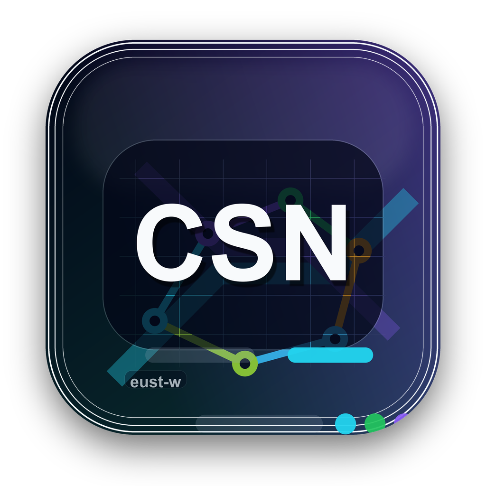
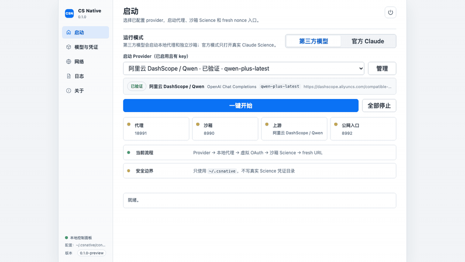
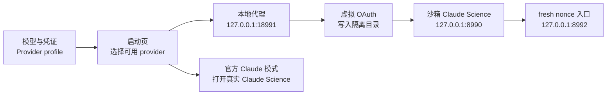
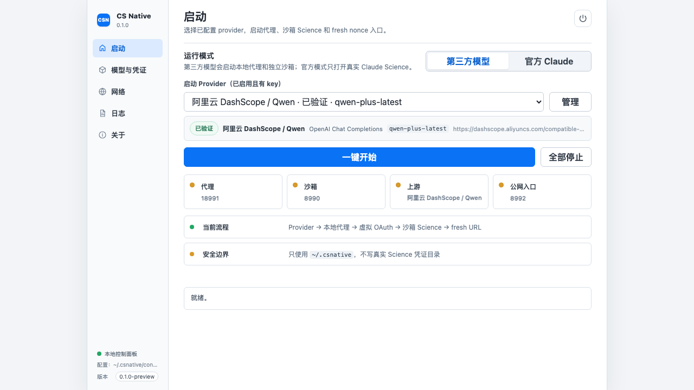
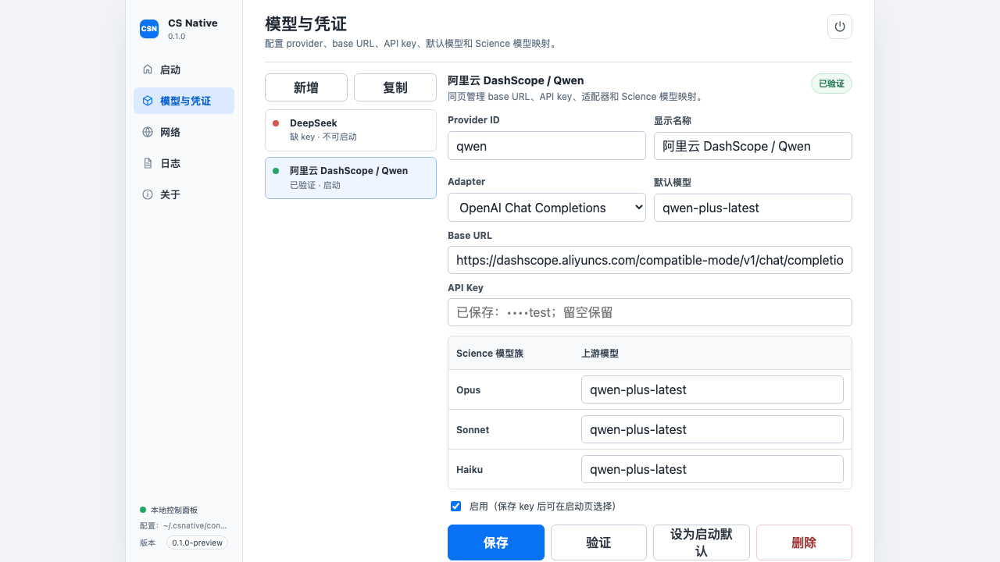
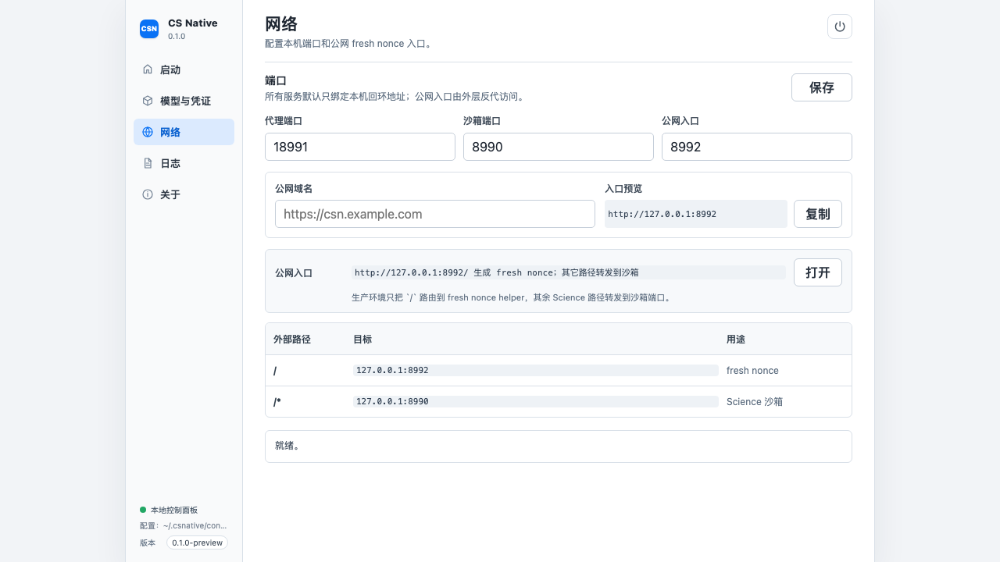
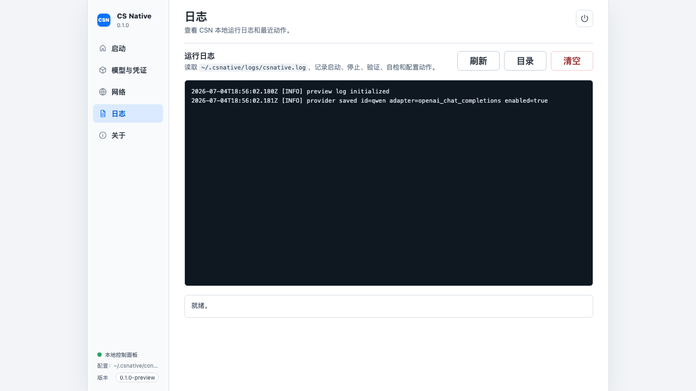
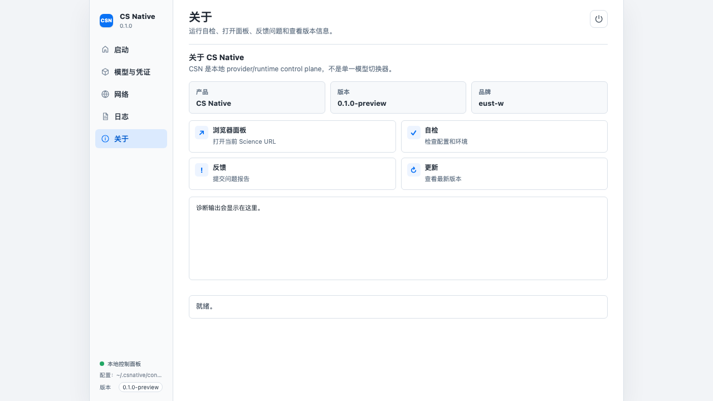
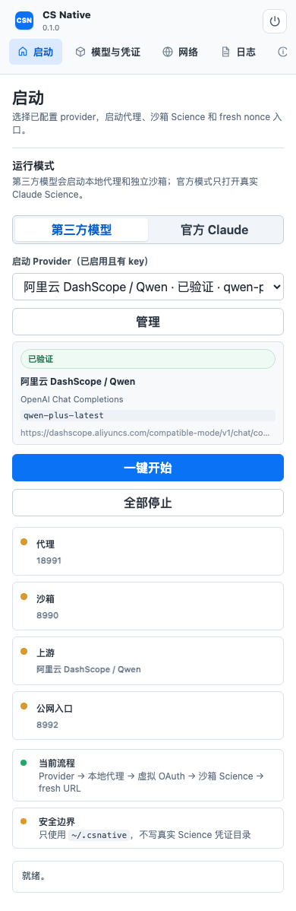

# CS Native

<p align="center">
  <strong>README</strong><br />
  <a href="README.md">🇨🇳 中文</a> ·
  <a href="docs/readme/README.en.md">🇺🇸 English</a> ·
  <a href="docs/readme/README.ko.md">🇰🇷 한국어</a> ·
  <a href="docs/readme/README.ar.md">🇸🇦 العربية</a> ·
  <a href="docs/readme/README.de.md">🇩🇪 Deutsch</a> ·
  <a href="docs/readme/README.fr.md">🇫🇷 Français</a> ·
  <a href="docs/readme/README.la.md">🇻🇦 Latina</a>
</p>

<p align="center">
  <a href="https://github.com/eust-w/CSNative/actions/workflows/release.yml"></a>
  <a href="https://github.com/eust-w/CSNative/actions/workflows/pages.yml"></a>
  <a href="https://github.com/eust-w/CSNative/releases/latest"></a>
</p>

<p align="center">
  
</p>

<p align="center">
  <strong>CS Native 是面向 Claude Science 的本地 provider / runtime control plane。</strong>
</p>

<p align="center">
  管理模型供应商、凭证、模型映射、代理、沙箱、fresh nonce 公网入口、日志和诊断，同时保留官方 Claude Science 独立入口。
</p>

<p align="center">
  <a href="https://eust-w.github.io/CSNative/">产品主页</a> ·
  <a href="https://github.com/eust-w/CSNative/releases/latest">下载最新版</a> ·
  <a href="https://github.com/eust-w/CSNative/pkgs/container/csnative-app">GHCR Package</a>
</p>

<p align="center">
  
</p>

## 产品定位

CS Native 不是单一的 DeepSeek / Qwen 切换器，也不是直接改写 Claude Science 真实登录状态的工具。它做的是本地运行控制：

- 第三方模型模式：在隔离目录里运行 Claude Science，把模型请求转发到你配置的 provider。
- 官方 Claude 模式：不注入环境变量，不托管官方登录，只打开真实 Claude Science。
- 本地控制面板：把 provider、API key、base URL、模型映射、端口、公网入口、日志和自检放在一个桌面应用里管理。

## 核心能力

| 能力 | 说明 |
| --- | --- |
| Provider Profile | 每个 provider 都有独立的 `id`、显示名称、adapter、base URL、API key、默认模型、模型列表和 Science 模型映射。 |
| 凭证与模型集中管理 | API key、base URL、默认模型、Opus / Sonnet / Haiku 映射都在 **模型与凭证** 页面配置，不再拆散到多个页面。 |
| 多 provider 预设 | 内置 DeepSeek、阿里云 DashScope / Qwen、OpenAI-compatible、Anthropic-compatible、OpenRouter、Moonshot / Kimi、SiliconFlow、Ollama。 |
| 自定义兼容端点 | 可以新增自己的 OpenAI-compatible 或 Anthropic-compatible provider，适合私有网关、本地模型服务或聚合平台。 |
| Adapter 路由 | 内置 `anthropic_messages` 和 `openai_chat_completions` 两类 adapter，负责请求构造、响应转换、流式输出和错误归一。 |
| 启动编排 | 一键启动本地代理、虚拟 OAuth、Claude Science 沙箱和 fresh nonce 入口，并在启动页显示端口、上游和运行状态。 |
| 沙箱运行 | 第三方模型模式只写入 `~/.csnative`，使用独立 HOME，不触碰真实 Claude Science 凭证目录。 |
| fresh nonce 公网入口 | 根路径生成 fresh nonce，其他路径转发到沙箱 Science，适合接入自己的公网域名或反向代理。 |
| 日志与自检 | 日志页读取真实本地日志；关于页提供 Doctor 自检、反馈、更新和版本信息。 |
| 多语言界面 | 桌面应用和 GitHub Pages 支持中文、英文、韩语、阿拉伯语、德语、法语、拉丁文，阿拉伯语使用 RTL 排版。 |
| 自动发布 | 推送 `v*` tag 后自动测试、`go vet`、Wails 构建、上传 Release 资产，并发布 GHCR package。 |

## 运行流程



第三方模型模式的主链路是：

```text
Provider -> 本地代理 -> 虚拟 OAuth -> 沙箱 Science -> fresh URL
```

## 界面与功能

### 启动

启动页只展示已经启用并保存 key 的 provider。选择 provider 后，可以一键启动或全部停止，并实时查看代理端口、沙箱端口、当前上游和公网入口状态。



主要功能：

- 在 **第三方模型** 与 **官方 Claude** 两种模式之间切换。
- 从已配置 provider 中选择当前启动上游。
- 显示 provider 验证状态、adapter、默认模型和 base URL 摘要。
- 一键启动本地代理、虚拟 OAuth、沙箱 Science 和 fresh nonce 入口。
- 官方 Claude 模式只打开真实 Claude Science，不改写第三方配置。

### 模型与凭证

模型与凭证页是 provider 控制中心。左侧是 provider 列表，右侧是当前 provider 的完整配置表单。



主要功能：

- 新增、复制、删除 provider。
- 编辑 provider ID、显示名称、adapter、base URL、API key 和默认模型。
- 管理 Opus、Sonnet、Haiku 三类 Claude Science 模型族到上游模型的映射。
- 保存、验证 provider，并设置启动默认 provider。
- 区分 **缺 key**、**未验证**、**已验证** 等状态，启动页只使用可启动 provider。
- 内置 provider 可改配置；自定义 provider 可接任何兼容端点。

### 网络与公网入口

网络页只负责运行网络设置，不混入 provider 或 key。



主要功能：

- 配置本地代理端口、沙箱端口、fresh nonce public entry 端口。
- 设置公网域名，用于生成可打开的 fresh URL。
- 明确公网路由设计：`/` 走 fresh nonce helper，其他路径转发沙箱 Science。
- 提供入口预览、复制和打开动作。

### 日志

日志页读取 `~/.csnative/logs/csnative.log`，不是静态占位文本。



主要功能：

- 刷新运行日志。
- 打开日志目录。
- 清空本地日志。
- 查看启动、停止、provider 验证、网络保存、自检等动作记录。

### 关于与诊断

关于页放产品信息、Doctor 自检、反馈、更新和版本信息。日志和关于分开，避免把工具入口和运行日志混在一起。



主要功能：

- 查看产品、版本、品牌信息。
- 打开当前浏览器面板。
- 运行 Doctor 检查配置和环境。
- 打开反馈和最新 Release。

## 基本用法

1. 打开 **模型与凭证**。
2. 选择一个内置 provider，或点击 **新增** 创建自定义 provider。
3. 填写 `base URL`、`API key`、`adapter`、默认模型和 Science 模型映射。
4. 点击 **保存**，再点击 **验证**。
5. 回到 **启动**，选择已启用且有 key 的 provider。
6. 点击 **一键开始**。
7. 使用启动页显示的 fresh nonce URL 打开沙箱 Science。
8. 如需使用真实 Claude Science，切换到 **官方 Claude** 模式。

## 下载与发布

产品主页：[https://eust-w.github.io/CSNative/](https://eust-w.github.io/CSNative/)

最新版本在 [GitHub Releases](https://github.com/eust-w/CSNative/releases/latest) 下载：

| 系统 / 架构 | 下载资产 | 内容 |
| --- | --- | --- |
| macOS Apple Silicon | `CSNative-v*-darwin-arm64.zip` | 压缩后的 macOS `.app` |
| macOS Intel | `CSNative-v*-darwin-amd64.zip` | 压缩后的 macOS `.app` |
| Windows x64 | `CSNative-v*-windows-amd64.zip` | Windows 可执行文件包 |
| Linux x64 | `CSNative-v*-linux-amd64.tar.gz` | Linux 可执行文件包 |
| 全平台 | `checksums.txt` | SHA-256 校验文件 |

Release 自动流程：

```text
tag v* -> go test -> go vet -> Wails build -> GitHub Release assets -> GHCR package
```

## 内置 provider

| Provider | Adapter | 默认用途 |
| --- | --- | --- |
| DeepSeek | `anthropic_messages` | Anthropic-compatible 上游 |
| 阿里云 DashScope / Qwen | `openai_chat_completions` | DashScope OpenAI-compatible chat completions |
| OpenAI-compatible | `openai_chat_completions` | 通用 OpenAI 兼容网关 |
| Anthropic-compatible | `anthropic_messages` | 通用 Anthropic Messages 兼容网关 |
| OpenRouter | `openai_chat_completions` | 聚合模型入口 |
| Moonshot / Kimi | `openai_chat_completions` | Kimi / Moonshot 兼容入口 |
| SiliconFlow | `openai_chat_completions` | SiliconFlow 兼容入口 |
| Ollama | `openai_chat_completions` | 本地模型服务，默认 `127.0.0.1:11434` |

所有预设都是可编辑模板。模型列表不会自动同步供应商市场，实际可用模型以 provider 控制台为准。

## 配置与安全边界

| 项目 | 路径 / 行为 |
| --- | --- |
| 配置目录 | `~/.csnative` |
| 配置文件 | `~/.csnative/config.json` |
| Provider key | 存在本地配置文件，权限 `0600` |
| 沙箱 HOME | `~/.csnative/sandbox/home` |
| 本地日志 | `~/.csnative/logs/csnative.log` |
| 真实 Claude Science 凭证目录 | 不写入 |
| 真实 OAuth token | 不复制到沙箱 |
| 官方 Claude 模式 | 不注入第三方 `ANTHROPIC_*` 环境变量 |

默认端口：

| 服务 | 地址 |
| --- | --- |
| 本地代理 | `127.0.0.1:18991` |
| Science 沙箱 | `127.0.0.1:8990` |
| fresh nonce 公网入口 | `127.0.0.1:8992` |

公网域名建议：

| 外部路径 | 本地目标 | 用途 |
| --- | --- | --- |
| `/` | `127.0.0.1:8992` | 生成 fresh nonce |
| `/*` | `127.0.0.1:8990` | 转发到 Science 沙箱 |

## 多语言

| 语言 | README | 应用 / 宣传页语言代码 |
| --- | --- | --- |
| 🇨🇳 中文 | [README.md](README.md) | `zh-CN` |
| 🇺🇸 English | [README.en.md](docs/readme/README.en.md) | `en` |
| 🇰🇷 한국어 | [README.ko.md](docs/readme/README.ko.md) | `ko` |
| 🇸🇦 العربية | [README.ar.md](docs/readme/README.ar.md) | `ar` |
| 🇩🇪 Deutsch | [README.de.md](docs/readme/README.de.md) | `de` |
| 🇫🇷 Français | [README.fr.md](docs/readme/README.fr.md) | `fr` |
| 🇻🇦 Latina | [README.la.md](docs/readme/README.la.md) | `la` |

桌面应用的语言入口在侧栏底部，GitHub Pages 宣传页的语言入口在右上角。语言选择会保存在本地，阿拉伯语会切换为 RTL 排版。

## 从源码运行

### 前提

- macOS
- 已安装 Claude Science
- 已安装 Go
- 已安装 Wails CLI
- 至少一个第三方 provider API key

### 构建与测试

```bash
go test ./...
go vet ./...
go build ./cmd/csnative
wails build
```

构建完成后，应用包位于：

```text
build/bin/CSNative.app
```

命令行入口：

```bash
go run ./cmd/csnative
```

## 目录结构

```text
cmd/csnative/                 命令行入口
internal/app/                 Wails app API、配置、启动、日志和自检
internal/config/              provider profile 与本地配置读写
internal/proxy/               Anthropic/OpenAI adapter 与代理逻辑
internal/oauth/               虚拟 OAuth 写入与护栏
internal/science/             Claude Science 沙箱进程和 public entry
internal/desktop/frontend/    设置面板静态前端
docs/                         GitHub Pages 与 README 资产
docs/readme/                  多语言 README
docs/assets/readme/           README 截图和动图
docs/brand.md                 品牌说明
build/appicon.png             生产图标源文件
```

## 开发检查

常用验证命令：

```bash
node --check internal/desktop/frontend/dist/main.js
go test ./...
go vet ./...
go build ./cmd/csnative
wails build -clean
```

如果改了页面交互，建议同时用浏览器打开静态前端检查：

```bash
cd internal/desktop/frontend/dist
python3 -m http.server 4179 --bind 127.0.0.1
```

然后访问：

```text
http://127.0.0.1:4179/
```

## 品牌

CS Native 使用 `CSN` 作为应用识别标记，并保留 `eust-w` 品牌方向。产品定位见 [docs/brand.md](docs/brand.md)。



## Star History

<a href="https://www.star-history.com/?repos=eust-w%2FCSNative&type=date&legend=top-left">
 <picture>
   <source media="(prefers-color-scheme: dark)" srcset="https://api.star-history.com/chart?repos=eust-w/CSNative&type=date&theme=dark&legend=top-left" />
   <source media="(prefers-color-scheme: light)" srcset="https://api.star-history.com/chart?repos=eust-w/CSNative&type=date&legend=top-left" />
   
 </picture>
</a>
